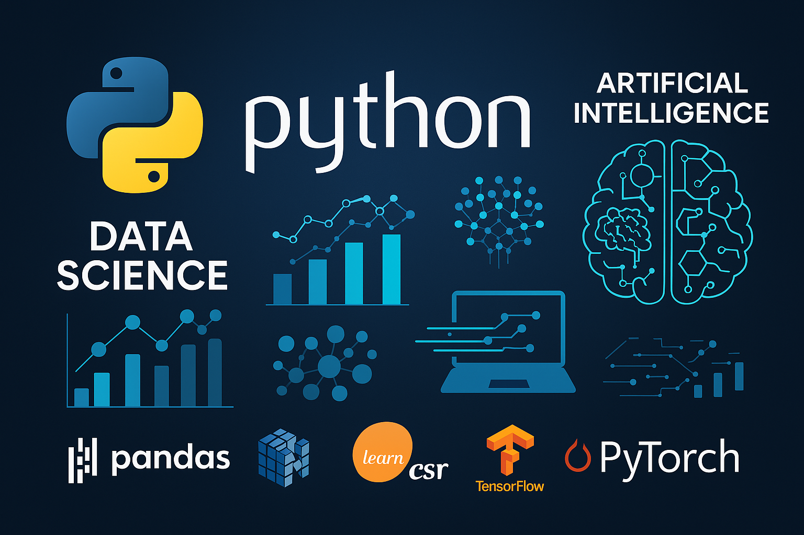

<h1 align="center">

    
Guilherme Matos 🚀 | Full Stack Developer
</h1>

  <em>Welcome to my space 🚀</em> 
   
  <em><strong>Welcome to my GitHub profile.</strong></em>

  
  
  

- 💻 **Full Stack Developer** specialized in **Java, Python, and JavaScript**.
- 🚀 Experienced in **Spring Boot, Angular, and TensorFlow development**.
- 🔬 Passionate about **Machine Learning and Deep Learning**.
- 🏗 Skilled in **design patterns**, **scalable architectures**, and **high-performance applications**.
- 🏋️ Jiu-Jitsu & Bodybuilding | Discipline inside and outside the code.
- 📖 **Science Fiction Fan** | Inspired by Asimov and intergalactic worlds.
- 🌱 **Continuous Learning** | Bootcamps and advanced technology courses.
- 📚 Always improving my skills and knowledge!

---

<h1 align="center">
  <em>🛠️ Technology Stack</em>
</h1>

<h2 align="center">
  <Strong>Languages & Frameworks</Strong>
</h2>

  
  
  
  
  
  
  
  

<h2 align="center">
  <Strong>Databases</Strong>
</h2>

  
  
  

<h2 align="center">
  <Strong>Tools & DevOps</Strong>
</h2>

  
  
  
  

---

<h2 align="center">
  <Strong>📂 Repositories 🔥</Strong>
</h2>

Here are some of my most relevant and engaging repositories:

  <!-- Repositório Projetos Python -->
  
  <!-- Repositório Artigo sobre Web3 e Blockchain -->
  
  <!-- Repositório Projeto Node.js ChatGPT -->
  
   <!-- Repositório Deep Learning -->
  
  <!-- Repositório Design Patterns -->
  
  <!-- Repositório Design Patterns II -->
  
  
---

🔍 **Explore my repositories for more projects and contributions!**

---

<h2 align="center">
  <Strong>📊 GitHub Stats</Strong>
</h2>

  

---

<h2 align="center">
  <Strong>🔥 Most Used Languages</Strong>
</h2>

  

---

<h2 align="center">
  <Strong>🏆 GitHub Trophies</Strong>
</h2>

  

---

<h2 align="center">
  <Strong>💡 Random Dev Quote</Strong>
</h2>

  

---

<h2 align="center">
  <Strong>📬 Contact Me</Strong>
</h2>

  
  

---

  <Strong>🔥 Let’s build something amazing together! 🚀</Strong>

